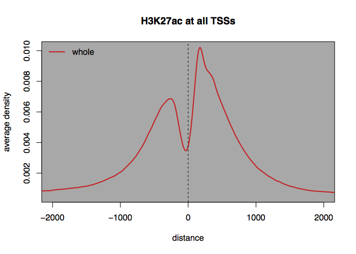
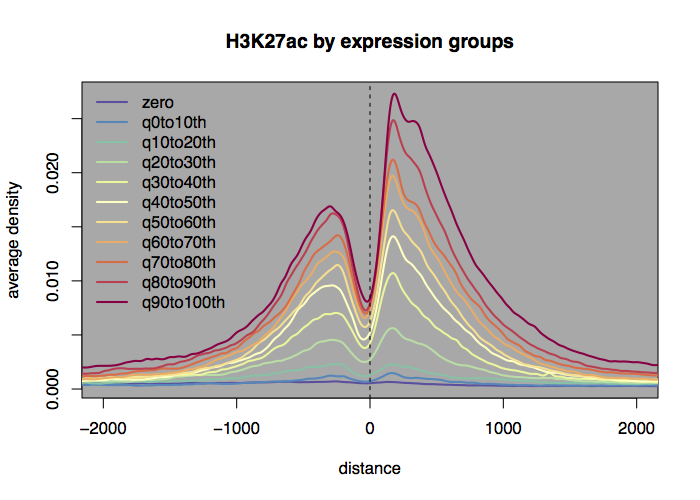
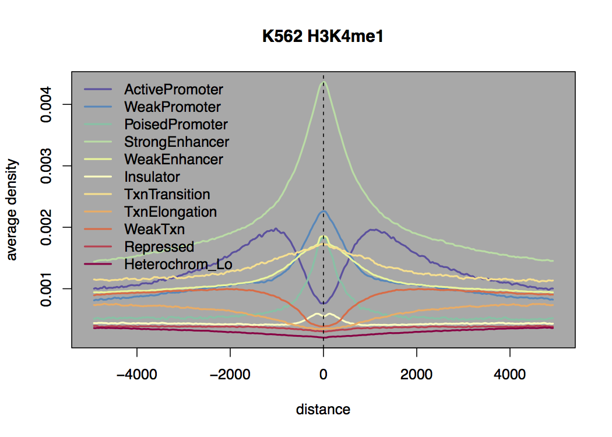

agplus: a rapid and flexible tool for aggregation plots
===========================================================

What's this for?
----------------

**agplus** is a simple command-line tool that enables rapid and flexible production of text tables tailored for aggregation plots from which users can easily design multiple groups based on user-definitions such as regulatory regions or transcription initiation sites.


Installation
------------

### Brief installation summary

Ruby and BEDTools are required to run **agplus**.

* [Ruby](https://www.ruby-lang.org) (version >2.0)
* [BEDTools](http://bedtools.readthedocs.org)

Place the **agplus** file and the supporting shell scripts anywhere you like. You will need the below software to use our supporting shell scripts (**bam2bwshifted**, **agpdraw-line** and **assignExprGroup**) and to follow our Tutorial section in this README.

* wigToBigWig: required by **bam2bwshifted**
* bigWigToWig: required in the Tutorial
* [SAMtools](http://samtools.sourceforge.net): required by **bam2bwshifted**
* [R](http://www.r-project.org): required by **agpdraw-line** and **assignExprGroup**
* RColorBrewer package of R: required by **agpdraw-line**

The wigToBigWig and bigWigToWig are available at 
<http://hgdownload.cse.ucsc.edu/admin/exe/>

You will also need *chrom.size* file to run **bam2bwshifted**. This file is a two-column text file of chromosome sizes. Please prepare the file if you have not yet. The example of generating *hg19.chrom.sizes* is in our Tutorial.

### Step by step installation instruction

For OSX users, we recommend to install [Homebrew](http://brew.sh). It is the easiest way to setup the environment to run agplus and we assume homebrew is already installed on your system. After installing homebrew, please "tap" homebrew/science repository, which contains hundreds of bioinformatics tools.

```
brew tap homebrew/science
```

Here we also assume that the user is under the *bash* shell environment and all tools are installed under the user's home directory (~/bin). Please set up the PATH environment as below.

```
mkdir ~/bin
echo 'export PATH=$HOME/bin:$PATH' >> ~/.bashrc
source ~/.bashrc
```

#### Ruby

We recommend Ruby version > 1.9. The version 2.x is preferable for computation speed. There are several way to install Ruby but we recommend the instructions below.

<https://www.ruby-lang.org/en/documentation/installation/>


#### R

For RedHat-based Linux users,

```
sudo yum install R
```

For Ubuntu users, please follow the instruction below.

<http://cran.r-project.org/bin/linux/ubuntu/README>

For OSX users after installing homebrew, just type:

```
brew install r
```

After installing R, please type the below command in R to install the *RColorBrewer* package.

```
install.packages("RColorBrewer")
```

#### SAMTools

For Ubuntu users,

```
apt-get install samtools
```

For OSX users,

```
brew install samtools
```

For the Redhat-based system,

```
yum install samtools
```

Please note that samtools is available at the EPEL repository.

#### BEDtools

Debian/Ubuntu:

```
apt-get install bedtools
```

RedHat - Fedora/Centos:

```
yum install bedtools
```

OSX:

```
brew install bedtools
```


#### Kent tools (fetchChromSizes, bigWigToWig, wigToBigWig)

Please download *bigWigToWig*, *wigToBigWig* and *fetchChromSizes* from

Linux: <http://hgdownload.cse.ucsc.edu/admin/exe/linux.x86_64/>

OSX: <http://hgdownload.cse.ucsc.edu/admin/exe/macOSX.x86_64/>

and place them into ~/bin.

```
chmod +x fetchChromSizes bigWigToWig wigToBigWig
mv fetchChromSizes bigWigToWig wigToBigWig ~/bin
```

#### agplus

The installation process of agplus simply requires copying the files into ~/bin.

```
git clone https://github.com/kazumits/agplus.git
cd agplus
cp agplus agpdraw-line assignExprGroup bam2bwshifted ~/bin
```

If you don't feel like using the git version, please download [the release version of agplus](https://github.com/kazumits/agplus/releases) and copy the scripts into ~/bin.

Usage
------------------

### agplus

generates a text table for the rapid and flexible creation of aggregation plots.

```
agplus [options] -b reference.bed [WIG/BEDGRAPH file(it expects STDIN if ommited)]
    -b, --reference=file             reference BED, requires strand(6th column) field (default: none, required)
    -d, --distance-from=origin       distance from start/center/end of the references is used (default: start)
    -o, --out=file                   output file name (default: STDOUT)
    -r, --range=from,to              aggregating range in base-pairs (default:-5000,5000)
    -a, --assignment=file            name->group assignment table, 2-column and tab-separated
```

### bam2bwshifted

converts BAM files into a coverage track (bigWig) of N bp shifted positions of the reads (fragment-midpoint). The midpoint counts are normalized as RPM (#reads per million reads).

```
bam2bwshifted [-o outfile.bw] [-s shiftsize (default: 73)] -g chrom.sizes BAM
```

### assignExprGroup

generates *assignment* file of expression level groups (given `-i` percentile expression level interval) from the *genes.fpkm_tracking* file of cufflinks (or cuffdiff).

```
assignExprGroup [-i interval] [-o outputdir] [-c column-name-of-gene] genes.fpkm_tracking
```

### agpdraw-line

draws smoothed (Gaussian filtered) curves from the agplus output file. -s *sdev* sets the smoothing parameter of the Gaussian kernel (the bigger the *sdev*, the smoother the curve).

```
agpdraw-line [-o outfile.pdf] [-s sdev] [-r from,to] [-t title] agplus-output.txt
```

File formats
-------

### Target

The *target* of your ChIP-Seq analysis should be in wiggle or bedgraph format.

Example:

```
chr1    9947    9948    0.052102
chr1    9952    9953    0.052102
chr1    9978    9979    0.052102
chr1    10003   10004   0.052102
chr1    10015   10016   0.052102
(...)
```

### Reference

The *reference* where you will aggregate *target* should be in BED6 format (6 columns BED). Typically, this file can be taken from a public database such as UCSC's table browser.

An example reference file of a gene locus looks like the following:

```
chr1    11873   14409   DDX11L1 0       +
chr1    14361   29370   WASH7P  0       -
chr1    34610   36081   FAM138F 0       -
chr1    34610   36081   FAM138A 0       -
chr1    69090   70008   OR4F5   0       +
(...)
```

### Assignment

The group *assignment* should be a two-column, tab-delimited text file. Typically, you write the *assignment* definitions, such as "gene-name[tab]group-name", per line in this file. Note that you do not need to write out all the names defined in *reference* here.

An example of *assignment* file of Up/Down/Stay genes groups looks like the following:

```
WASH7P	Upregulated
OR4F6	Upregulated
DDX11L1	Downregulated
FAM138A	Downregulated
FAM138F	Stay
(...)
```

### Output

The output file of **agplus** is simple tab-delimited table of average signal intensities in 1 bp per line. The table can be easily handled by subsequent analysis using gnuplot, R, Matlab, MS Excel, etc.

Example:

```
distance	whole
-5000	0.0006606468404588093
-4999	0.0006476077580813323
-4998	0.0006345686757038559
(...)
4997    0.000534602377476536
4998    0.0004911387695516146
4999    0.0005128705735140753
5000    0.000554161001042751
```

Tutorial
--------

This tutorial aims to visualize H3K27ac ChIP-Seq signal distributions at transcription start sites (TSSs) grouped by the gene expression levels. The example data are H3K27ac ChIP-Seq of HeLa-S3 cells provided by the ENCODE/Broad Institute ([GSE29611](http://www.ncbi.nlm.nih.gov/geo/query/acc.cgi?acc=GSE29611)). The expression levels of HeLa-S3 were determined by ENCODE/Caltech RNA-Seq data ([GSE33480](http://www.ncbi.nlm.nih.gov/geo/query/acc.cgi?acc=GSE33480)).

### Prerequistics

You need to download the BAM file of H3K27ac ChIP-Seq from UCSC. 

* [ENCODE/Broad HeLa-S3 H3K27ac ChIP-Seq](http://hgdownload.cse.ucsc.edu/goldenPath/hg19/encodeDCC/wgEncodeBroadHistone/wgEncodeBroadHistoneHelas3H3k27acStdAlnRep1.bam)

We recommend using [UDR](http://rabadan.c2b2.columbia.edu/ENCODE/newsarch.html#091213) for faster downloading of ENCODE data from UCSC.

To define expression groups using **assignExprGroup**, you need the *genes.fpkm_tracking* file of cufflinks (or cuffdiff) output using [this bam](http://hgdownload.cse.ucsc.edu/goldenPath/hg19/encodeDCC/wgEncodeCaltechRnaSeq/wgEncodeCaltechRnaSeqHelas3R2x75Il200AlignsRep1V2.bam). For convenience, we prepared a pre-calculated *genes.fpkm_tracking* file of HeLa-S3. Please download [the file](http://chromatin.med.kyushu-u.ac.jp/maehara/agplus/genes.fpkm_tracking.gz) and decompress it.

Additionally, you need a gene locus definition file in BED6 format as *reference*. We prepared a parsed file from UCSC's hg19 refFlat definition for **agplus** (available from the table browser). Please download [the file](http://chromatin.med.kyushu-u.ac.jp/maehara/agplus/refFlat_hg19_simple.bed.gz) and decompress it.

### Four steps to generating an aggregation plot

Please prepare the hg19.chrom.sizes to follow this tutorial.

```
fetchChromSizes hg19 > hg19.chrom.sizes
```

Step 1: generate a coverage track (bigWig) file of fragment midpoints (`-s 100`; half-size of 200 bp) from the *target* BAM file

```
bam2bwshifted -s 100 -g hg19.chrom.sizes -o HeLaS3_H3K27ac.bw wgEncodeBroadHistoneHelas3H3k27acStdAlnRep1.bam
```

Step 2: decompress the bigWig file to treat with **agplus**

```
bigWigToWig HeLaS3_H3K27ac.bw HeLaS3_H3K27ac.wig
```

Step 3: aggregate *target* signals at all TSSs defined in *reference*

```
agplus -b refFlat_hg19_simple.bed -d start -o aggr_HeLaS3_H3K27ac.txt HeLaS3_H3K27ac.wig
```

The aggregation process takes about 2 minutes assuming the use of  Intel(R) Xeon(R) CPU E5-2687W @ 3.10GHz on x86_64 GNU/Linux)

>89.98s user 0.29s system 63% cpu 2:23.18 total

One can also combine Steps 2 & 3 to reduce the number of intermediate files.

```
bigWigToWig HeLaS3_H3K27ac.bw stdout | agplus -b refFlat_hg19_simple.bed -d start -o aggr_HeLaS3_H3K27ac.txt
```

Step4: draw the aggregation plot

```
agpdraw-line -t "H3K27ac at all TSSs" -r -2000,2000 -o H3K27acAllTSS.pdf aggr_HeLaS3_H3K27ac.txt
```

The result of a typical PDF file is shown below.



Please note that the aggregation is done against all TSSs when you omit the `-a` assignment file option, i.e. all gene TSSs are assigned to "whole" group.

### Grouping by assignment file

If you would like to see the distribution by expression levels, incorporate the following procedure after Step 2.

Create an assignment file from the genes.fpkm_tracking file.

```
assignExprGroup -i 10 genes.fpkm_tracking
```

The output file is produced under the *assignedPer10* directory. Please check the file *egroup_ePer10.txt* that is automatically generated as the *assignment* file. The *assignment* file is the group definition of genes per 10%ile interval gene expression levels. (The output will be a multiple text file of different samples when the file is from *cuffdiff*.)

Then, Run agplus with the assignment file. 

```
bigWigToWig HeLaS3_H3K27ac.bw stdout | agplus -b refFlat_hg19_simple.bed -d start -a assignedPer10/egroup_ePer10.txt -o aggr_HeLaS3_H3K27ac_Expr10pt.txt
```

> 93.64s user 0.32s system 65% cpu 2:24.28 total

Finally, run agpdraw-line to get the PDF output.

```
agpdraw-line -t "H3K27ac by expression groups" -r -2000,2000 -o H3K27acByExpression.pdf aggr_HeLaS3_H3K27ac_Expr10pt.txt
```

The result:




Advanced example: H3K4me1 distributions on ChromHMM segments
------------------------------------------------------------

This example aims to visualize the distributions of H3K4me1 signal, which is related to enhancer regions on each genomic segment predicted by [ChromHMM](http://compbio.mit.edu/ChromHMM/).

Download and unzip chromHMM bed for K562 cells.

```
wget http://hgdownload.cse.ucsc.edu/goldenPath/hg19/encodeDCC/wgEncodeBroadHmm/wgEncodeBroadHmmK562HMM.bed.gz
gunzip wgEncodeBroadHmmK562HMM.bed.gz
```

Reformat the file into 6-column BED with strand so that agplus can handle it as reference.

```
awk -v OFS="\t" '{print $1,$2,$3,$4,0,"+"}' wgEncodeBroadHmmK562HMM.bed > chromHMM_K562_reformatted.bed
```

The strands were all fixed at "+" because there is no infromation of orientation in the file.

Create a tab-delimited assignment file manually as below with any text editor or MS Excel and then save it as `assign_chromHMM.txt`.  You can  copy & paste this example but you should be aware that the delimiters should be **tab**s (tabs are often transformed into multiple white spaces when pasting).

```
1_Active_Promoter	ActivePromoter
2_Weak_Promoter	WeakPromoter
3_Poised_Promoter	PoisedPromoter
4_Strong_Enhancer	StrongEnhancer
5_Strong_Enhancer	StrongEnhancer
6_Weak_Enhancer	WeakEnhancer
7_Weak_Enhancer	WeakEnhancer
8_Insulator	Insulator
9_Txn_Transition	TxnTransition
10_Txn_Elongation	TxnElongation
11_Weak_Txn	WeakTxn
12_Repressed	Repressed
13_Heterochrom/lo	Heterochrom_Lo
```

The names of the first column were taken from ChromHMM definition (4th column in original file). We merged some categories (the second column; StrongEnhancer and WeakEnhancer) to reduce the use of colors in the plot of this example.


Download K562 H3K4me1 ChIP-Seq data (mapped bam file) using [udr](http://rabadan.c2b2.columbia.edu/ENCODE/newsarch.html#091213).

```
udr rsync -avP hgdownload-sd.sdsc.edu::goldenPath/hg19/encodeDCC/wgEncodeBroadHistone/wgEncodeBroadHistoneK562H3k4me1StdAlnRep1.bam .
```

Create mid-points count file (bigWig) from the bam.

```
bam2bwshifted -s 100 -g hg19.chrom.sizes -o K562_H3K4me1.bw wgEncodeBroadHistoneK562H3k4me1StdAlnRep1.bam
```

Run agplus using the prepared files above.

```
bigWigToWig K562_H3K4me1.bw stdout | agplus -b chromHMM_K562_reformatted.bed -d center -a assign_chromHMM.txt -o aggr_K562_H3K4me1_chromHMM.txt
```

The caluclation takes about 30 min (30 times longer than Tutorial) because chromHMM reference is about 30 times larger than gene definition (23,975 vs. 622,257 lines).

Finally, you will get the plot PDF shown below.

```
agpdraw-line -t "K562 H3K4me1" aggr_K562_H3K4me1_chromHMM.txt 
```




FAQ
----

Q. What is "average density" that agpdraw-line reports?

A. The area under the curve in plot makes group-averaged read/peak number. The "density" was defined so that the area under the (smoothed) curve makes total aggregated read/peak numbers. agplus reports the averaged densities over group members which is defined in the reference and assignment files. Please note that the read count is RPM (Read Per Million) normalized when you use bam2bwshifted.


Q. Can agplus aggregate **peaks** (not raw reads)?

A. Yes. agplus can accepts peak-called file (BED or BED-like format) after reformatting. For example, peaks were recorded in `peaks.bed` file:

```
awk -v OFS="\t" '{print $1,$2,$3,1}' peaks.bed > peaks.wig
```

and give "peaks.wig" as the target file of agplus. In this case, "average density" of the plot can be regarded as "average peak detection rate".

If the peaks file contains a score column (tag-count, p-value, fold-enrichment, etc.) and you would like to calculate average of the scores, you can replace `{print $1,$2,$3,1}` to `{print $1,$2,$3,$7}` if you want to use the 7th column of the original BED file as the score.

We recommend using the peak summits file as target/reference file if available. Using peak summits could improve accuracy/resolution of signal source positioning. 


Q. How to change the look of the plot (colors, line widths, drawing range of y-axis).

A. We recommend using your own line drawing software to change the looks freely. The output file of agplus is a simple text table and thus can be easily imported into any software, e.g. MS Excel, gnuplot, R, Matlab (or you can directly edit the output PDF by vector graphics software like Adobe's Illustrator). 

Please note that the line-smoothing function is part of agpdraw-line and thus is not done by agplus. We provided agpdraw-line as a visual example of agplus output and consider it is sufficient in most cases.


Citation
--------

Plese cite the following reference:

+ Kazumitsu Maehara and Yasuyuki Ohkawa, agplus: a rapid and flexible tool for aggregation plots, Bioinformatics, 2015,
doi: [10.1093/bioinformatics/btv322](http://dx.doi.org/10.1093/bioinformatics/btv322)